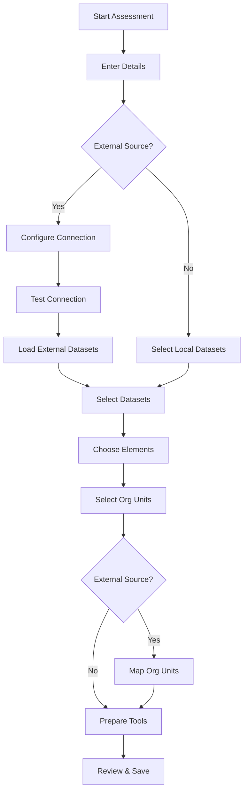
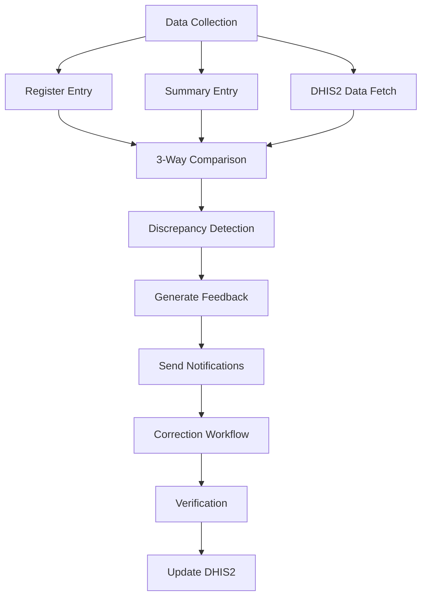
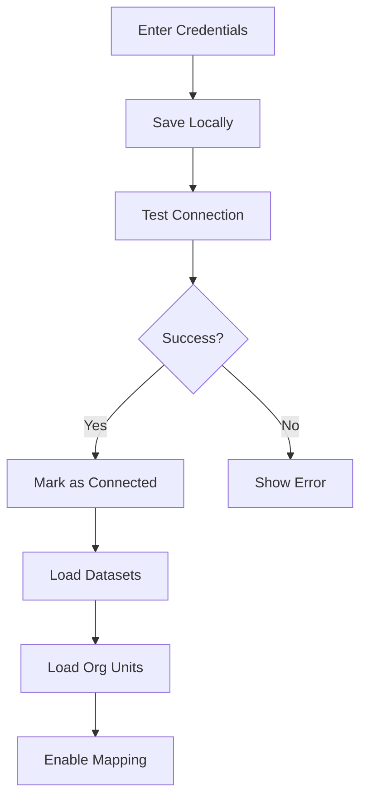

# DHIS2 DQA360 - Development Documentation

This document contains comprehensive development information, troubleshooting guides, and implementation details for DHIS2 DQA360.

## 📋 Table of Contents

- [Quick Start](#quick-start)
- [Architecture Overview](#architecture-overview)
- [Key Features & Implementation](#key-features--implementation)
- [Recent Fixes & Improvements](#recent-fixes--improvements)
- [Development Workflows](#development-workflows)
- [Troubleshooting Guide](#troubleshooting-guide)
- [API Integration](#api-integration)
- [Testing & Deployment](#testing--deployment)
- [Performance Optimization](#performance-optimization)

## 🚀 Quick Start

### Prerequisites
- Node.js 16+ and npm/yarn
- Access to a DHIS2 instance
- Git for version control

### Development Setup
```bash
# Clone and setup
git clone https://github.com/HISP-Uganda/dhis2-dqa360.git
cd dhis2-dqa360
npm install

# Start with demo instance
./start-dev.sh
# or manually
d2-app-scripts start --proxy https://play.im.dhis2.org/stable-2-41-4-1
```

**Demo Credentials:**
- URL: https://play.im.dhis2.org/stable-2-41-4-1
- Username: `admin` | Password: `district`

## 🏗 Architecture Overview

### Core Components

```
src/
├── components/                 # Reusable UI components
│   ├── Layout/                # App layout and navigation
│   ├── AuthorityGuard/        # Permission-based access control
│   └── Router/                # Application routing
├── pages/                     # Main application pages
│   ├── Dashboard/             # Overview and metrics
│   ├── ManageAssessments/     # Assessment creation wizard
│   │   └── AssessmentSteps/   # Multi-step wizard components
│   ├── DQAData/              # Data entry and management
│   ├── Administration/        # System administration
│   └── ViewAssessment/        # Assessment viewing
├── services/                  # API services and utilities
├── utils/                     # Utility functions and helpers
├── hooks/                     # Custom React hooks
└── constants/                 # Application constants
```

### Technology Stack
- **Frontend**: React 18 + DHIS2 UI Components
- **State Management**: React Hooks + Context API
- **Routing**: React Router v6
- **Forms**: React Hook Form with validation
- **DHIS2 Integration**: DHIS2 App Runtime
- **Authentication**: DHIS2 OAuth + Custom credential management

## 🔧 Key Features & Implementation

### 1. Multi-Step Assessment Wizard

**Location**: `src/pages/ManageAssessments/`

**Steps**:
1. **Details**: Basic assessment information
2. **Connection**: External DHIS2 configuration
3. **Datasets**: Dataset selection from local/external
4. **Elements**: Data element selection
5. **Units**: Organization unit selection
6. **Mapping**: External to local org unit mapping
7. **Preparation**: Metadata and tool generation
8. **Review**: Final review and save

**Key Files**:
- `CreateAssessmentPage.jsx` - Main wizard container
- `AssessmentSteps/` - Individual step components
- `assessmentDataStoreService.js` - Data persistence

### 2. External DHIS2 Integration

**Features**:
- Secure credential storage
- Connection testing and validation
- Dataset and metadata synchronization
- Organization unit mapping

**Implementation**:
```javascript
// Connection testing
const testConnection = async () => {
    const auth = btoa(`${username}:${password}`)
    const response = await fetch(`${baseUrl}/api/me`, {
        headers: { 'Authorization': `Basic ${auth}` }
    })
    return response.ok
}

// Credential storage
localStorage.setItem('dqa360_external_config', JSON.stringify({
    baseUrl, username, password, status: 'ok'
}))
```

### 3. Permission System

**Levels** (Priority Order):
1. **SUPERUSER** - Auto-detected system admins
2. **DQA ADMIN** - Full DQA360 access
3. **DQA USER** - Basic DQA360 access
4. **NO ACCESS** - Default state

**Implementation**:
```javascript
// Authority detection
const getUserPermissionLevel = (user) => {
    if (user.authorities?.includes('ALL')) return 'SUPERUSER'
    if (user.authorities?.includes('DQA360_ADMIN')) return 'DQA_ADMIN'
    if (user.authorities?.includes('DQA360_USER')) return 'DQA_USER'
    return 'NO_ACCESS'
}
```

### 4. Data Quality Engine

**3-Way Comparison**:
- Register data vs Summary data vs DHIS2 data
- Configurable variance thresholds
- Automated discrepancy detection
- Visual indicators for data quality issues

### 5. Metadata Management

**Automated Creation**:
- Category combinations and categories
- Category options
- Assessment-specific datasets
- Data elements and indicators

**Key Utility**: `src/utils/assessmentToolsCreator.js`

## 🔄 Recent Fixes & Improvements

### Authentication & Connection Management ✅

**Problem**: Authentication triggered when just adding credentials
**Solution**: 
- Authentication only on connection testing
- Credentials saved without authentication
- Connection status validation before proceeding

**Files Modified**:
- `ConnectionStep.jsx` - Connection testing logic
- `CreateAssessmentPage.jsx` - Validation workflow

### Organization Unit Mapping ✅

**Problem**: Wrong org units showing in mapping dropdown
**Solution**:
- Fixed local org unit loading logic
- Proper filtering and display
- Enhanced error handling

**Implementation**:
```javascript
// Load local org units with proper pagination
const loadLocalOrgUnits = async () => {
    let allOrgUnits = []
    let page = 1
    let hasMore = true
    
    while (hasMore) {
        const response = await dataEngine.query({
            organisationUnits: {
                resource: 'organisationUnits',
                params: {
                    fields: 'id,name,code,level,path,parent[id,name,code]',
                    paging: true,
                    pageSize: 1000,
                    page: page,
                },
            },
        })
        
        const orgUnits = response?.organisationUnits?.organisationUnits || []
        const pager = response?.organisationUnits?.pager
        
        allOrgUnits = [...allOrgUnits, ...orgUnits]
        hasMore = pager && pager.page < pager.pageCount
        page++
    }
    
    return allOrgUnits
}
```

### Deprecated Paging Warnings ✅

**Problem**: `paging=false` deprecation warnings
**Solution**: Replaced with proper pagination

**Files Fixed**:
- `CreateAssessmentPage.jsx`
- `DataSetManagement.jsx`
- `assessmentToolsCreator.js`

**Before/After**:
```javascript
// Before (deprecated)
params: { paging: false }

// After (proper pagination)
params: { paging: true, pageSize: 1000 }
```

### HTML Encoding Issues ✅

**Problem**: URLs displayed with HTML entities
**Solution**: Proper string handling and display

## 🔧 Development Workflows

### 1. Assessment Creation Flow



### 2. Data Quality Assessment Flow



### 3. External DHIS2 Integration Flow



## 🐛 Troubleshooting Guide

### Common Issues & Solutions

#### 1. Authentication Failures
**Symptoms**: Login fails, 401 errors
**Solutions**:
- Verify DHIS2 instance URL
- Check username/password
- Ensure user has required authorities
- Test connection manually

#### 2. Org Unit Mapping Issues
**Symptoms**: Empty dropdowns, wrong units
**Solutions**:
- Check local org unit loading
- Verify external connection
- Clear localStorage cache
- Restart development server

#### 3. Dataset Creation Failures
**Symptoms**: Metadata creation errors
**Solutions**:
- Check user permissions
- Verify category combo existence
- Review DHIS2 logs
- Use manual metadata creation

#### 4. Performance Issues
**Symptoms**: Slow loading, timeouts
**Solutions**:
- Implement pagination
- Reduce API call frequency
- Use loading states
- Optimize queries

### Debug Mode
Enable comprehensive logging:
```javascript
localStorage.setItem('dqa360_debug', 'true')
```

### Common Error Codes
- **401**: Authentication required
- **403**: Insufficient permissions
- **404**: Resource not found
- **409**: Conflict (duplicate data)
- **500**: Server error

## 🔌 API Integration

### DHIS2 API Endpoints

#### Authentication
```javascript
GET /api/me - Current user info
GET /api/me/authorities - User authorities
```

#### Metadata
```javascript
GET /api/dataSets - Available datasets
GET /api/dataElements - Data elements
GET /api/organisationUnits - Organization units
GET /api/categoryCombos - Category combinations
```

#### Data
```javascript
GET /api/dataValueSets - Data values
POST /api/dataValueSets - Submit data
GET /api/analytics - Analytics data
```

### External DHIS2 Integration

```javascript
// Connection configuration
const externalConfig = {
    baseUrl: 'https://external-dhis2.org',
    username: 'user',
    password: 'pass',
    apiVersion: '41'
}

// API call with authentication
const fetchExternalData = async (endpoint) => {
    const auth = btoa(`${username}:${password}`)
    const response = await fetch(`${baseUrl}/api/${endpoint}`, {
        headers: {
            'Authorization': `Basic ${auth}`,
            'Content-Type': 'application/json'
        }
    })
    return response.json()
}
```

## 🧪 Testing & Deployment

### Testing Strategy

#### Unit Tests
```bash
npm test
```

#### Integration Tests
- Test assessment creation workflow
- Verify external DHIS2 connection
- Test data quality comparison

#### Manual Testing Checklist
- [ ] Assessment wizard completion
- [ ] External connection setup
- [ ] Org unit mapping
- [ ] Data entry forms
- [ ] Permission system
- [ ] Report generation

### Deployment

#### Development
```bash
npm start
```

#### Production Build
```bash
npm run build
```

#### DHIS2 Deployment
```bash
npm run deploy
```

### Environment Configuration

#### Development
```bash
# .env.development
REACT_APP_DHIS2_BASE_URL=https://play.im.dhis2.org/stable-2-41-4-1
REACT_APP_DEBUG=true
```

#### Production
```bash
# .env.production
REACT_APP_DHIS2_BASE_URL=https://your-dhis2-instance.org
REACT_APP_DEBUG=false
```

## ⚡ Performance Optimization

### Best Practices

#### 1. API Optimization
- Use pagination for large datasets
- Implement caching for metadata
- Batch API requests when possible
- Use appropriate field filters

#### 2. React Optimization
- Use React.memo for expensive components
- Implement proper dependency arrays in useEffect
- Avoid unnecessary re-renders
- Use lazy loading for routes

#### 3. Data Management
- Implement proper loading states
- Use optimistic updates
- Cache frequently accessed data
- Implement proper error boundaries

### Performance Monitoring

```javascript
// Performance measurement
const measurePerformance = (name, fn) => {
    const start = performance.now()
    const result = fn()
    const end = performance.now()
    console.log(`${name} took ${end - start} milliseconds`)
    return result
}
```

## 🔐 Security Considerations

### Authentication
- Use DHIS2 OAuth when possible
- Store credentials securely
- Implement proper session management
- Use HTTPS in production

### Data Protection
- Validate all user inputs
- Sanitize data before display
- Implement proper access controls
- Follow DHIS2 security guidelines

### Best Practices
- Regular security audits
- Keep dependencies updated
- Use environment variables for secrets
- Implement proper error handling

## 📊 Monitoring & Logging

### Application Logging
```javascript
// Structured logging
const logger = {
    info: (message, data) => console.log(`[INFO] ${message}`, data),
    error: (message, error) => console.error(`[ERROR] ${message}`, error),
    debug: (message, data) => {
        if (localStorage.getItem('dqa360_debug')) {
            console.log(`[DEBUG] ${message}`, data)
        }
    }
}
```

### Performance Metrics
- API response times
- Component render times
- User interaction tracking
- Error rates and types

## 🚀 Future Enhancements

### Planned Features
- Real-time data synchronization
- Advanced analytics dashboard
- Mobile application support
- Offline capability
- Multi-language support

### Technical Improvements
- GraphQL API integration
- Progressive Web App features
- Advanced caching strategies
- Microservice architecture
- Automated testing pipeline

---

This development documentation provides comprehensive guidance for working with DHIS2 DQA360. For additional support, refer to the DHIS2 documentation or create an issue in the repository.